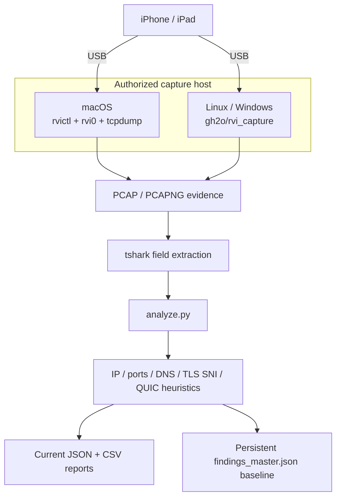

# RVI-Sentinel

### Cross-platform iPhone/iPad packet capture and persistent network-baseline analysis


> **Scope:** RVI-Sentinel is a defensive, cross-platform toolkit for authorized iPhone/iPad packet capture and persistent network-baseline analysis. It combines Apple's native Remote Virtual Interface workflow on macOS with the upstream `gh2o/rvi_capture` backend on Linux and Windows, while keeping capture and analysis independent.

---

## Table of Contents

- [Overview](#overview)
- [Executive Summary](#executive-summary)
- [Overall Architecture](#overall-architecture)
- [Verified Analyzer Screenshot](#verified-analyzer-screenshot)
- [Installation](#installation)
- [Analyze an Existing Capture](#analyze-an-existing-capture)
- [macOS Capture with Apple RVI](#macos-capture-with-apple-rvi)
- [Linux and Windows Capture](#linux-and-windows-capture)
- [Persistent Baselining](#persistent-baselining)
- [Current Analysis Fields](#current-analysis-fields)
- [Encryption Limitations](#encryption-limitations)
- [Testing Without Live Capture](#testing-without-live-capture)
- [Repository Structure](#repository-structure)
- [Privacy and Responsible Use](#privacy-and-responsible-use)
- [Evidence and Provenance](#evidence-and-provenance)
- [Conclusions](#conclusions)
- [Upstream Source](#upstream-source)
- [License](#license)

---

## Overview

RVI-Sentinel is a defensive network-analysis toolkit for inspecting packet captures over time. It supports Apple's native Remote Virtual Interface (`rvictl`) workflow on macOS and integrates the upstream [`gh2o/rvi_capture`](https://github.com/gh2o/rvi_capture) project for iPhone/iPad packet capture on Linux and Windows.

The project deliberately separates **capture** from **analysis**:

> A packet capture shows what happened during one session. A persistent baseline shows what changed.

The analyzer works with ordinary `.pcap` and `.pcapng` files from any authorized source. An iPhone, `rvictl`, or `rvi0` is not required to use the analysis engine.

---

## Executive Summary

- macOS iPhone/iPad capture with Apple `rvictl` + `rvi0` + `tcpdump`.
- Linux and Windows iPhone/iPad capture through [`gh2o/rvi_capture`](https://github.com/gh2o/rvi_capture).
- PCAP and PCAPNG analysis through `tshark`.
- IPv4 and IPv6 endpoint inventory.
- TCP and UDP port-frequency analysis.
- DNS query extraction.
- TLS Server Name Indication (SNI) extraction when visible.
- QUIC/HTTP/3-style traffic heuristics, including UDP/443 activity.
- DNS-label Shannon entropy heuristic for generated or encoded-looking names.
- Persistent first-seen / last-seen observations across captures.
- New-vs-known endpoint, DNS, and TLS-hostname detection.
- JSON investigation reports and CSV exports.
- Deterministic integration test that validates analysis without live capture.

### Direct capability vs. interpretation

| Type | Finding |
|---|---|
| **Direct capability** | `capture_rvi.sh` drives Apple's `rvictl` / `rvi0` / `tcpdump` workflow on macOS. |
| **Direct capability** | `capture_mobile.py` integrates the separately fetched `gh2o/rvi_capture` backend for Linux and Windows. |
| **Direct capability** | `analyze.py` accepts authorized PCAP or PCAPNG input and produces persistent JSON plus CSV findings. |
| **Direct verification** | The deterministic analyzer integration test passes without an iPhone, `rvictl`, or `rvi0`. |
| **Interpretation boundary** | A newly observed endpoint or hostname is a baseline change, not proof of malicious activity. |
| **Visibility boundary** | Packet metadata does not defeat TLS, QUIC, VPNs, Private Relay, encrypted DNS, ECH, or application-layer encryption. |

---

## Overall Architecture



The two capture paths converge on the same host-independent analysis pipeline.

<details>
<summary>Text-only architecture</summary>

```text
                              iPhone / iPad
                                   |
                                   | USB
                    +--------------+--------------+
                    |                             |
                  macOS                    Linux / Windows
                    |                             |
                 rvictl                    gh2o/rvi_capture
                    |                             |
                  rvi0                            |
                    |                             |
                 tcpdump                          |
                    +--------------+--------------+
                                   |
                                   v
                              PCAP / PCAPNG
                                   |
                                   v
                                tshark
                                   |
                      +------------+------------+
                      |            |            |
                      v            v            v
                 IP / ports       DNS       TLS / QUIC
                      |            |            |
                      +------------+------------+
                                   |
                                   v
                              analyze.py
                                   |
                      +------------+------------+
                      |                         |
                      v                         v
                 Current report            Persistent state
                  JSON + CSV              findings_master.json
```

</details>

The key design rule is:

```text
CAPTURE LAYER != ANALYSIS LAYER
```

---

## Verified Analyzer Screenshot


The screenshot records the repository's deterministic analyzer integration test. It verifies packet-field parsing, IPv4 endpoint tracking, DNS and TLS SNI extraction, QUIC-like classification, DNS entropy handling, JSON/CSV exports, persistent baselining, and known/new differentiation without requiring live device capture.

---

## Installation

Clone RVI-Sentinel:

```bash
git clone https://github.com/hideouts-io/RVI-Sentinel.git
cd RVI-Sentinel
```

Check the analyzer:

```bash
python3 analyze.py --help
```

RVI-Sentinel currently uses Python's standard library. Packet decoding requires `tshark`, the command-line component of Wireshark.

---

## Analyze an Existing Capture

Given:

```text
capture.pcapng
```

run:

```bash
python3 analyze.py capture.pcapng
```

Outputs are written to:

```text
data/findings_master.json

exports/
├── capture_report.json
├── capture_endpoints.csv
├── capture_dns.csv
└── capture_tls_sni.csv
```

Use a dedicated baseline for one device or investigation:

```bash
python3 analyze.py capture.pcapng \
  --baseline data/iphone_baseline.json \
  --export-dir exports/iphone
```

---

## macOS Capture with Apple RVI

Connect and trust the iPhone/iPad over USB.

Find its UDID:

```bash
xcrun xctrace list devices
```

Start RVI:

```bash
./capture_rvi.sh start <UDID>
```

or directly:

```bash
rvictl -s <UDID>
```

A virtual interface such as `rvi0` should appear:

```bash
ifconfig rvi0
```

Capture:

```bash
./capture_rvi.sh capture captures/ios_capture.pcapng
```

Equivalent manual command:

```bash
sudo tcpdump -i rvi0 -n -s 0 -U \
  -w captures/ios_capture.pcapng
```

Analyze:

```bash
python3 analyze.py captures/ios_capture.pcapng
```

Stop RVI:

```bash
./capture_rvi.sh stop <UDID>
```

---

## Linux and Windows Capture

### Capture with `gh2o/rvi_capture`

RVI-Sentinel integrates the open-source project:

**https://github.com/gh2o/rvi_capture**

The upstream project describes itself as **`rvictl for Linux and Windows`** and creates packet-capture dumps from connected iOS devices. It supports both PCAP and PCAPNG, optional UDID selection, file/FIFO output, stdout streaming, and direct Wireshark streaming.

RVI-Sentinel does **not** copy the upstream Python implementation into this repository. Instead, the setup helper clones the canonical source directly so provenance remains clear.

Install the upstream capture backend locally:

```bash
python3 scripts/setup_rvi_capture.py
```

It is placed at:

```text
tools/rvi_capture/
```

That directory is intentionally ignored by Git.

Update the upstream checkout later with:

```bash
python3 scripts/setup_rvi_capture.py --update
```

The setup helper prints the exact upstream commit SHA so you can record which capture implementation produced a packet trace.

See [`SOURCES.md`](SOURCES.md) for attribution and provenance details.

---

## Linux prerequisites

Upstream documents the following requirements:

- Python 3
- `libimobiledevice`
- `usbmuxd` running

On Debian/Ubuntu-derived systems, a typical starting point is:

```bash
sudo apt update
sudo apt install python3 libimobiledevice-utils usbmuxd
```

Confirm that the connected device is visible:

```bash
idevice_id -l
```

Install the upstream backend:

```bash
python3 scripts/setup_rvi_capture.py
```

Capture an iPhone/iPad to PCAPNG:

```bash
python3 capture_mobile.py \
  captures/iphone_linux.pcapng
```

Select a particular device:

```bash
python3 capture_mobile.py \
  --udid <IPHONE_UDID> \
  captures/iphone_linux.pcapng
```

Capture and immediately analyze:

```bash
python3 capture_mobile.py \
  --analyze \
  captures/iphone_linux.pcapng
```

---

## Windows prerequisites

Upstream documents the following requirements:

- Python 3
- iTunes / Apple mobile-device components
- `AppleMobileDeviceService.exe` running

The upstream project states that its required `libimobiledevice` components are downloaded as needed on Windows.

From PowerShell:

```powershell
python scripts\setup_rvi_capture.py
```

Capture:

```powershell
python capture_mobile.py `
  captures\iphone_windows.pcapng
```

Specify the UDID:

```powershell
python capture_mobile.py `
  --udid <IPHONE_UDID> `
  captures\iphone_windows.pcapng
```

Capture and analyze in one workflow:

```powershell
python capture_mobile.py `
  --analyze `
  captures\iphone_windows.pcapng
```

---

## Direct upstream usage

After running the setup helper, you can invoke upstream `rvi_capture.py` directly.

Linux:

```bash
python3 tools/rvi_capture/rvi_capture.py \
  --format pcapng \
  --udid <IPHONE_UDID> \
  captures/iphone.pcapng
```

Windows PowerShell:

```powershell
python tools\rvi_capture\rvi_capture.py `
  --format pcapng `
  --udid <IPHONE_UDID> `
  captures\iphone.pcapng
```

If `--udid` is omitted, upstream selects the first device it finds.

Then analyze normally:

```bash
python3 analyze.py captures/iphone.pcapng
```

---

## Stream directly into Wireshark

The upstream project can write capture data to stdout:

```bash
./tools/rvi_capture/rvi_capture.py - | wireshark -k -i -
```

For RVI-Sentinel investigations, saving a PCAPNG first is often preferable because it creates a repeatable evidence artifact that can be re-analyzed later.

---

## iOS interface metadata

PCAPNG can retain interface metadata. The upstream `rvi_capture` documentation discusses iOS interfaces such as:

```text
en0       Wi-Fi
pdp_ip0   cellular
ipsec1    IPSec outer transport observed for VoLTE
ipsec3    IPSec inner transport observed for VoLTE
```

In Wireshark, inspect:

```text
frame.interface_name
```

This can help distinguish traffic paths when the capture includes the relevant metadata.

---

## Cross-platform capture matrix

| Host OS | iPhone/iPad capture backend | Output | RVI-Sentinel analysis |
|---|---|---|---|
| macOS | Apple `rvictl` + `tcpdump` | PCAP/PCAPNG | Yes |
| Linux | `gh2o/rvi_capture` + `libimobiledevice`/`usbmuxd` | PCAP/PCAPNG | Yes |
| Windows | `gh2o/rvi_capture` + Apple mobile-device services | PCAP/PCAPNG | Yes |
| Any analysis host | Existing authorized PCAP/PCAPNG | PCAP/PCAPNG | Yes |

---

## Persistent Baselining

The default state database is:

```text
data/findings_master.json
```

For observed endpoints, DNS names, and visible TLS SNI values, RVI-Sentinel records historical context including first seen, last seen, observation counts, capture membership, and recent capture counts.

This allows a later capture to distinguish previously observed infrastructure from newly observed infrastructure.

A new endpoint or hostname is **not automatically suspicious**. It is simply a change worth contextualizing.

---

## Current analysis fields

RVI-Sentinel asks `tshark` for fields including:

```text
frame.time_epoch
ip.src
ip.dst
ipv6.src
ipv6.dst
tcp.srcport
tcp.dstport
udp.srcport
udp.dstport
dns.qry.name
tls.handshake.extensions_server_name
_ws.col.Protocol
```

---

## Encryption limitations

RVI packet visibility does not defeat TLS, QUIC, VPN encryption, iCloud Private Relay, encrypted DNS, ECH, or application-layer encryption.

You may still observe useful metadata such as source/destination addresses, ports, timing, traffic volume, unencrypted DNS, visible TLS SNI, and protocol classifications.

RVI-Sentinel does not attempt to bypass device security controls or decrypt protected application content.

---

## Testing without live capture

Run:

```bash
python3 tests/test_analyzer.py
```

The test does not connect to an iPhone, invoke `rvictl`, create `rvi0`, or capture live traffic. It supplies deterministic fake `tshark` field output and validates the analysis layer independently.

Expected completion includes:

```text
PASS: analyzer works without rvictl/rvi0
```

---

## Repository structure

```text
RVI-Sentinel/
├── analyze.py
├── capture_rvi.sh             # macOS rvictl/rvi0 capture
├── capture_mobile.py          # Linux/Windows frontend
├── scripts/
│   └── setup_rvi_capture.py   # fetch canonical gh2o/rvi_capture source
├── evidence/
│   └── rvi-sentinel-analyzer-test.png
├── SOURCES.md                 # upstream provenance/attribution
├── README.md
├── requirements.txt
├── LICENSE
├── .gitignore
├── tests/
│   └── test_analyzer.py
├── captures/
├── data/
├── exports/
└── tools/
    └── rvi_capture/           # local upstream clone; intentionally ignored
```

---

## Privacy and responsible use

Packet captures can reveal sensitive metadata even when payloads are encrypted. The repository ignores PCAP files, generated reports, local baselines, and the local upstream checkout by default.

Use RVI-Sentinel only with devices, networks, and packet captures you own or are explicitly authorized to inspect.

---

## Evidence and Provenance

This repository keeps capture provenance, analysis output, and interpretation separate:

| Layer | Evidence or record |
|---|---|
| **Capture implementation** | macOS uses Apple `rvictl` and `tcpdump`; Linux and Windows use a separately cloned canonical `gh2o/rvi_capture` checkout. |
| **Backend provenance** | `scripts/setup_rvi_capture.py` prints the exact upstream commit SHA after installation. |
| **Packet evidence** | PCAP or PCAPNG files remain independent inputs that can be retained and re-analyzed. |
| **Current findings** | JSON and CSV exports describe the supplied capture. |
| **Historical context** | The persistent baseline records first seen, last seen, counts, and capture membership. |
| **Verification evidence** | `tests/test_analyzer.py` validates the analysis layer deterministically; the screenshot above records a passing run. |

Live device capture depends on the host OS, USB trust state, and the platform-specific prerequisites documented above. The deterministic test verifies the analysis pipeline, not a live macOS, Linux, or Windows device session.

For third-party attribution and redistribution boundaries, see [`SOURCES.md`](SOURCES.md).

---

## Conclusions

RVI-Sentinel provides three host capture paths with one common analysis model:

- macOS capture through Apple's native RVI tooling.
- Linux capture through `gh2o/rvi_capture`, `libimobiledevice`, and `usbmuxd`.
- Windows capture through `gh2o/rvi_capture` and Apple mobile-device services.
- Host-independent analysis of existing authorized PCAP and PCAPNG evidence.
- Persistent comparison of endpoints, DNS names, and visible TLS SNI across captures.
- Explicit limits: baseline changes require context, and encrypted content remains protected.

The central design principle is that capture produces evidence, while analysis and persistent baselining explain how that evidence differs from earlier observations.

---

## Upstream Source

Linux/Windows iOS capture functionality is provided by the separately maintained upstream project:

https://github.com/gh2o/rvi_capture

RVI-Sentinel's integration code does not claim authorship of that implementation. See [`SOURCES.md`](SOURCES.md).

---

## License

RVI-Sentinel's own project code is MIT licensed. See [`LICENSE`](LICENSE). Upstream dependencies retain their own copyright and licensing status.
